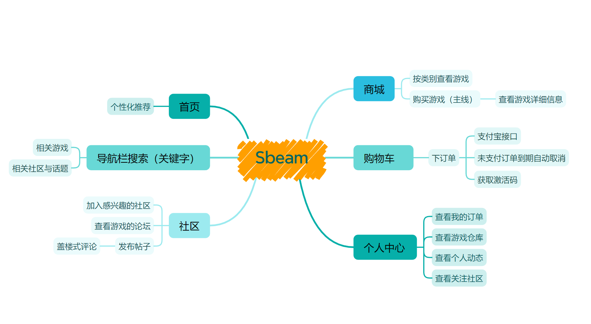
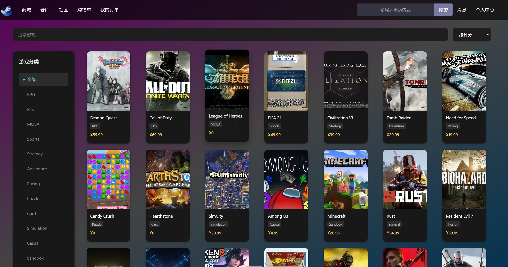
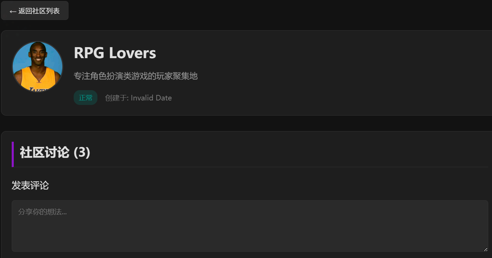
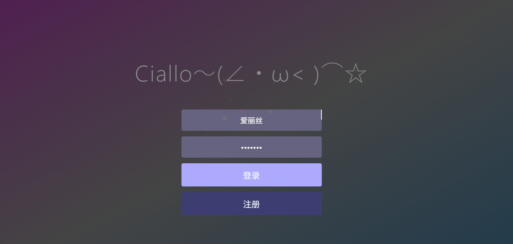

# 项目详细介绍
sbeam是一个集游戏电商、社区互动与用户游戏库管理于一体的全栈Web应用平台，旨在为游戏玩家提供完整的游戏购买、社区交流和游戏管理体验。


## 一、项目架构与技术栈
### 1. 整体架构
采用前后端分离的微服务架构，通过RESTful API实现数据交互，确保系统的松耦合性和可扩展性。

### 2. 技术栈 后端技术栈
- 基础框架 ：Spring Boot 3.5.6（Java 17）
- ORM框架 ：MyBatis Plus 3.5.5
- 数据库 ：MySQL 8.0.33（关系型数据存储）
- 缓存系统 ：Redis（分布式缓存、分布式锁、计数器）
- 消息队列 ：RabbitMQ（异步任务处理、实时消息通知）
- 搜索引擎 ：Elasticsearch 8.10.0（全文搜索、游戏/社区检索）
- 文档数据库 ：MongoDB（存储帖子等半结构化数据）
- 对象存储 ：MinIO（游戏图片、用户头像等文件存储）
- 定时任务 ：XXL-Job（订单超时处理、数据同步）
- 数据同步 ：Canal（数据库变更监听与同步）
- 认证授权 ：JWT（基于Token的身份验证）
- API文档 ：Swagger 3.0.0
- 支付集成 ：支付宝SDK 3.1.0 前端技术栈
- 框架 ：Vue 3（Composition API）
- 语言 ：TypeScript
- UI组件库 ：Element Plus
- 状态管理 ：Pinia
- 路由 ：Vue Router
- HTTP客户端 ：Axios
- 构建工具 ：Vite
- 代码规范 ：ESLint + Prettier
## 二、核心功能模块
### 1. 游戏电商系统 游戏商品管理



- 游戏信息管理：包含游戏名称、描述、价格、标签等
- 游戏图片管理：支持多图片上传与展示
- 游戏标签系统：实现游戏分类与筛选
- 游戏价格管理：支持折扣设置与价格历史记录 订单与支付系统
- 订单创建流程 ：
  - 用户从购物车选择游戏，点击结算
  - 后端生成唯一订单号，计算订单金额
  - 通过RabbitMQ异步处理订单创建，确保系统高可用
  - 设置15分钟订单超时机制，防止资源占用
- 订单状态管理 ：
  - 待支付（unpaid）
  - 已支付（paid）
  - 已取消（cancelled）
- 支付流程 ：
  - 集成支付宝SDK，支持在线支付
  - 支付回调处理：
    - 同步回调：支付成功后跳转至订单详情页
    - 异步回调：支付宝服务器主动通知，更新订单状态
- 订单幂等性保证 ：
  - Redis分布式锁防止重复创建订单
  - 订单状态检查避免重复处理支付结果
  - 乐观锁机制确保并发更新安全 用户游戏库
- 游戏购买后自动添加到用户游戏库
- 支持游戏查询、排序与筛选
- 游戏来源标记（购买/BUY、礼包/GIFT）
- CDKey管理：购买后自动分配游戏激活码
### 2. 社区互动平台 社区管理



- 游戏社区创建：自动为每个游戏生成对应的讨论社区
- 社区信息管理：名称、描述、状态等
- 社区加入与退出机制
- 社区搜索与筛选功能（基于Elasticsearch） 帖子与评论系统
- 帖子发布：支持标题、内容输入
- 帖子列表展示：按时间顺序，包含点赞数、评论数统计
- 评论功能：支持多级回复，形成讨论链
- 点赞功能：实现帖子点赞计数与状态管理 实时消息通知
- 基于RabbitMQ的消息队列系统：
  - 评论队列：处理用户评论通知
  - 点赞队列：处理用户点赞通知
  - 系统通知队列：处理系统级消息
- 消息过期机制：不同类型消息设置不同TTL（如点赞1天，评论7天）
- 死信队列：过期消息统一处理
### 3. 用户管理系统 用户认证与授权



- 注册与登录功能
- JWT Token身份验证
- 角色权限控制（普通用户/管理员） 用户信息管理
- 用户资料设置
- 游戏库管理
- 订单历史查询
- 个人收藏管理
### 4. 搜索与推荐系统 全文搜索
- 基于Elasticsearch实现：
  - 游戏搜索
  - 社区搜索
  - 帖子搜索
- 支持关键词高亮与相关度排序 游戏推荐
- 集成Flask服务提供个性化游戏推荐
- 基于用户购买历史与行为分析
## 三、主要负责模块
### 1. 订单与支付系统 ——订单创建、查询和状态管理

- 订单创建 ：用户通过前端发起订单创建请求，后端接收后生成唯一订单号，计算订单金额，设置订单状态为"待支付"
- 订单处理 ：使用RabbitMQ异步处理订单创建，将订单信息持久化到MySQL，并设置15分钟超时机制
- 订单查询 ：支持按订单状态（全部/已支付/未支付/已取消）筛选查询
- 状态管理 ：订单状态包括待支付、已支付、已取消，通过定时任务和支付回调更新 2. 支付宝支付集成
- 支付发起 ：用户点击支付按钮，后端生成支付宝支付表单，前端跳转至支付宝支付页面
- 支付回调 ：
  - 同步回调：支付成功后跳转至订单详情页
  - 异步回调：支付宝服务器主动通知后端，更新订单状态为"已支付"
- 支付记录 ：创建支付流水记录，记录交易信息 3. 订单幂等性保证
- Redis分布式锁 ：使用Redis实现分布式锁，防止重复创建订单
- 幂等性检查 ：在支付回调处理中，通过订单状态检查避免重复处理支付结果
- 乐观锁 ：使用version字段实现乐观锁，确保并发更新订单时的数据一致性

```
用户选择游戏 → 加入购物车 → 提交订单 → 生
成订单号 → 发送RabbitMQ消息 → 异步创建订
单 → 返回订单信息 → 用户支付 → 支付宝回
调 → 更新订单状态 → 分配CDKey → 添加到用
户游戏库
```
### 2. 社区互动平台 ——游戏社区创建与管理


- 社区创建 ：支持创建游戏社区，设置社区名称、描述等信息
- 社区加入 ：用户可申请加入社区，参与社区讨论
- 社区状态 ：管理社区状态（正常/异常），维护社区秩序 2. 帖子发布与评论功能
- 帖子发布 ：社区成员可发布帖子，包含标题、内容等信息
- 帖子列表 ：按时间顺序展示社区内帖子，支持点赞、评论统计
- 评论系统 ：支持对帖子进行评论和回复，形成讨论链 3. RabbitMQ实时消息通知
- 消息队列配置 ：设置评论队列、点赞队列、系统通知队列
- 异步消息处理 ：评论、点赞等操作通过RabbitMQ异步处理，提高系统响应速度
- 消息过期机制 ：为不同类型消息设置TTL（如点赞消息1天过期，评论消息7天过期）
- 死信队列 ：过期消息进入死信队列，便于后续处理和分析

```
用户加入社区 → 发布帖子 → 其他用户浏览 → 
评论/回复/点赞 → 发送RabbitMQ通知 → 相
关用户收到消息 → 实时更新互动数据
```
### 3. 技术设计亮点
- 异步处理 ：大量使用RabbitMQ实现异步任务，提高系统响应速度和吞吐量
- 分布式锁 ：基于Redis实现分布式锁，解决并发场景下的数据一致性问题
- 缓存策略 ：Redis缓存热点数据（如用户游戏库），减少数据库压力
- 搜索引擎 ：Elasticsearch提供高效的全文搜索能力
- 微服务架构 ：系统模块松耦合，便于独立扩展和维护
- 安全性 ：JWT认证、接口幂等性设计、支付安全集成
## 四、部署与运维
### 1. 开发环境
- JDK 17
- MySQL 8.0
- Redis 6.x
- RabbitMQ 3.10.x
- Elasticsearch 8.10.0
- MongoDB 6.x
- Node.js 20.x
### 2. 构建与部署
- 后端：Maven构建，Spring Boot打包为JAR文件
- 前端：Vite构建，生成静态资源
- 支持Docker容器化部署
